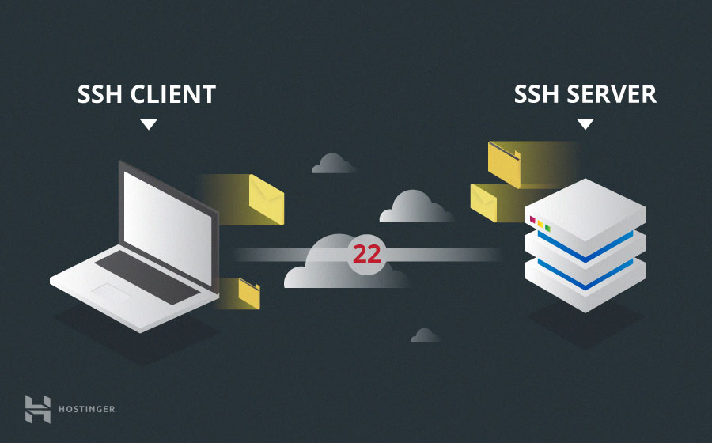

# Tests

## Accès en SSH

```text
ssh utilisateur@ip
```

## Compte admin vs root

A la différence du compte admin, root équivaut à Dieu, il est suprême, il peut tout faire. Le compte admin, quant à lui, peut également être soumis à des restrictions au niveau des permissions.

## Accès en root impossible via SSH

```text
cat /etc/ssh/sshd_config
nano /etc/ssh/sshd_config
```

```text
PermitRootLogin: no
```

## Dessin de l'architecture client/server ssh



## Configuration sudo

```text
sudo adduser foo sudo
```

## Sources

| Titre | Lien |
| :--- | :--- |
| Sudo | [https://wiki.debian.org/sudo](https://wiki.debian.org/sudo) |
| Diagramme | [Image Hostinger](https://external-content.duckduckgo.com/iu/?u=https%3A%2F%2Fwww.hostinger.com%2Ftutorials%2Fwp-content%2Fuploads%2Fsites%2F2%2F2017%2F07%2Fssh-client-and-server.jpg&f=1&nofb=1) |

