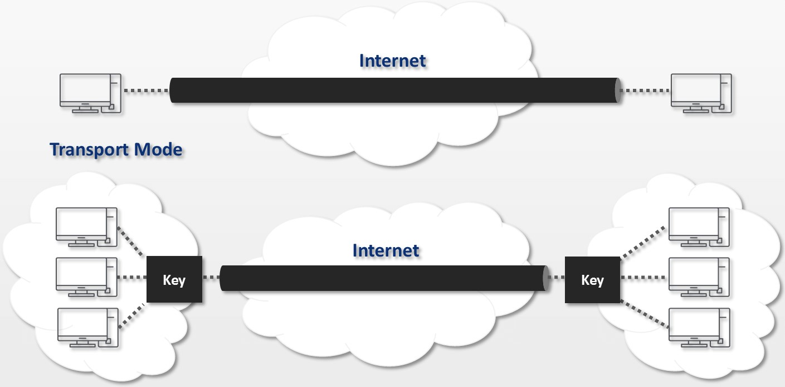

# Ports & Protocoles

| **Protocole** | Port | Description |
| :--- | :--- | :--- |
| Telnet | 23 | Protocole utilisé sur tout réseau TCP/IP, permettant de communiquer avec un serveur distant en échangeant des lignes de texte |
| FTP | 21 | Protocole de communication destiné au partage de fichiers sur un réseau TCP/IP. |
| SSH | 22 | Protocole conçu pour remplacer Telnet et FTP. |

## **IPSEC**

Défini par l'IETF comme un cadre de standards ouverts pour assurer des communications privées et protégées sur des réseaux IP, par l'utilisation des services de sécurité cryptographiques, est un ensemble de protocoles utilisant des algorithmes permettant le transport de données sécurisées sur un réseau IP.

