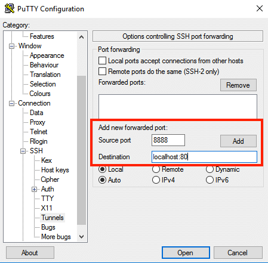
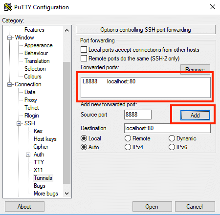

# Protocole Tests Sprint 4

## Théorie

### Droits sur les fichiers et répertoires

| Permission Unique | Symbole | Niveau |
| :--- | :---: | :---: |
| Permission lecture | r | 4 |
| Permission écriture | w | 2 |
| Permission d'exécution | x | 1 |
| Pas de permission | - | 0 |

| Permissions combinées | Symbole | Niveau |
| :--- | :---: | :---: |
| L' utilisateur peut lire, écrire et exécuter | rwx | 7 |
| L'utilisateur peut uniquement lire et écrire | rw- | 6 |
| L' utilisateur peut uniquement lire et exécuter | r-x | 5 |

| Permissions multiples | Symbole | Niveau |
| :--- | :---: | :---: |
| Le propriétaire et le groupe ont tous les droits | rwxrwx--- | 770 |
| Toutes les permissions pour tout le monde | rwxrwxrwx | 777 |
| Uniquement le propriétaire à toute les permissions | rwx------ | 700 |

### Compte de service

Un compte de service est souvent utilisé lorsqu'un service tel qu'un serveur web, mail, ou autre souhaite effectuer des actions incluants des droits particuliers. Afin de permettre à ces services de fonctionner, on crée un compte pour chaque service et on lui assigne uniquement les droits dont il en a besoin.

```text
#Create service account
sudo useradd -r samba

#List All users
getent passwd
```

### Scripting sous Linux

```text
#!/bin/bash

function listArguments(){
    for i in $@; do
        echo $i
    done;
}

listArguments $@

./listArguments.sh hello world cpnv
```

### Compression de fichier sous Linux

```text
#Create file
touch bla.txt

#Create tarball from bla.txt
tar -cvf new.tar bla.txt

#Show size
du -sh new.tar

#Compress tarball
gzip -v new.tar

#Uncompress tarball
gunzip -v new.tar.gz

#Extract tarball
tar -xvf new.tar

#Extract tarball to specific location
tar -C ~/Desktop -xvf new.tar
```

## Partage Réseau

### Installation Samba

```text
sudo apt update
sudo apt install samba
```

### Création de dossiers privé et publique

```text
# Create public folder
sudo mkdir /home/Public

# Create private folder
sudo mkdir /home/Private
```

### Permissions de dossiers

```text
# Add permission to the public folder
sudo chmod 0777 ~/Desktop/Public
sudo chown -R nobody:nogroup ~/Desktop/Public


#Create a group
sudo groupadd security

#Grant permissions to the private group
sudo chgrp security ~/Desktop/Private
sudo chmod -R 0770 ~/Desktop/Private
```

### Fichier de configuration

```text
#Create a backup file
mv /etc/samba/smb.conf /etc/samba/smb.conf.bak

#Modify samba configuration file
sudo nano /etc/samba/smb.conf
```

### Configurations des partages de fichiers

```text
[global]
        workgroup = WORKGROUP
        server string = Samba Server %v
        netbios name = ubuntu
        security = user
        map to guest = bad user
        name resolve order = bcast host
        dns proxy = no
        bind interfaces only = yes

[Public]
        path = /home/bes-sama/Desktop/Public
        writable = yes
        guest ok = yes
        guest only = yes
        read only = no
        create mode = 0777
        directory mode = 0777
[Private]
        path = /home/bes-sama/Desktop/Private
        writable = yes
        guest ok = no
        read only = no
        browsable = yes
        create mode = 0770
        directory mode = 0770
        valid users = @security
```

### Ajout d'utilisateur au groupe de sécurité

```text
#Add members to group
sudo usermod -aG security debianadmin
```

### Création mot de passe Samba

```text
sudo smbpasswd -a debianadmin
```

### Redémarrer le service

```text
sudo systemctl restart smbd

sudo systemctl status smbd
```

## Moteur de base de données

### Bonnes pratiques respectées

### Accès depuis le serveur de base de données \(en local\)

### Accès uniquement pour un client \(voir schéma\)

## Environnement

### Comment accéder au sous réseau privé

```text
ssh -L port:host:port user@host
```





### Identifier les ports et les protocoles à autoriser \(ainsi que le sens de communication\)

| Service | Port | Protocole |
| :--- | :--- | :--- |
| MySQL | 3306 | TCP |
| SMB | 445 | SMB |

### Identifier les rôles de chaque instance

## Sources

| Titre | Lien |
| :--- | :--- |
| Create a Public Samba Share on Ubuntu | [Lien](https://websiteforstudents.com/create-public-samba-share-ubuntu-17-04-17-10/) |
| Create a Private Samba Share on Ubuntu | [Lien](https://websiteforstudents.com/create-private-samba-share-ubuntu-17-04-17-10/) |
| Bash command to archive files daily based on date added | [Lien](https://stackoverflow.com/questions/37486454/bash-command-to-archive-files-daily-based-on-date-added) |
| How to Find a File in Linux Using the Command Line | [Lien](https://www.lifewire.com/uses-of-linux-command-find-2201100) |

