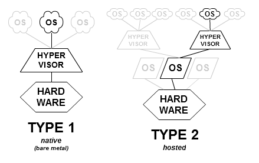

# Virtualisation Types

## **Virtualisation Types**

### **Type I** 

Logiciel de virtualisation natif installé directement sur le matériel informatique. Le noyau de l’hôte est allégé et optimisé pour l’OS.

#### **Exemple**

| **Oracle VM, Microsoft Hyper-V.** |
| :--- |

### **Type II**

La virtualisation de type 2 s'exécute au sein de l'OS hôte, lui délégant ainsi la gestion du matériel sous-jacent.

Un système d'exploitation invité s'exécute en troisième niveau au-dessus du matériel. Les systèmes d'exploitation invités n'ayant pas conscience d'être virtualisés, ils n'ont pas besoin d'être adaptés.

#### **Exemple**

| **VirtualBox d'Oracle, VMware Workstation, VMware Fusion** |
| :--- |

